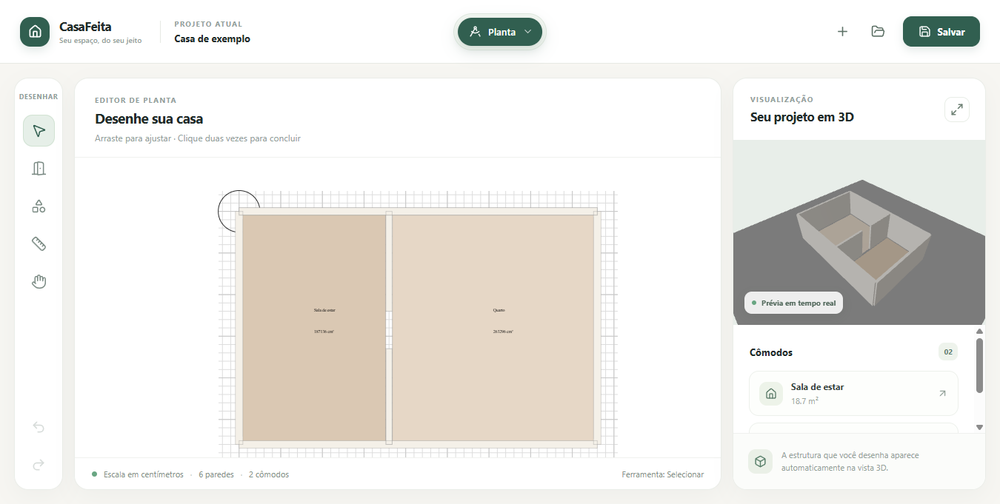
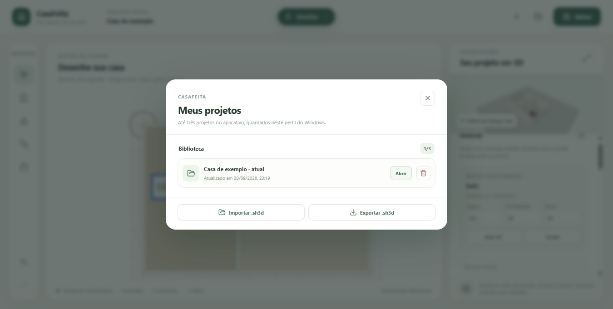
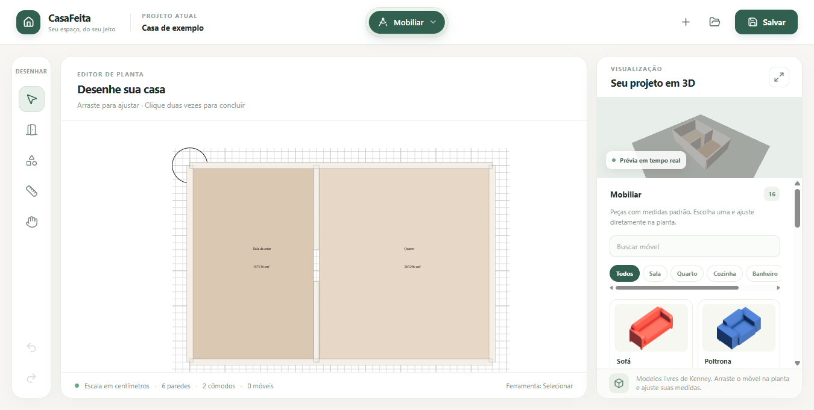
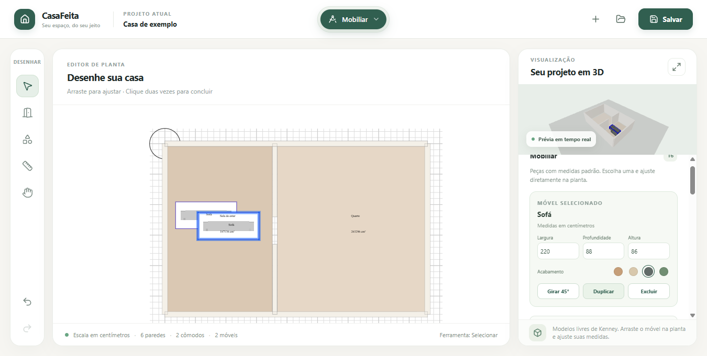
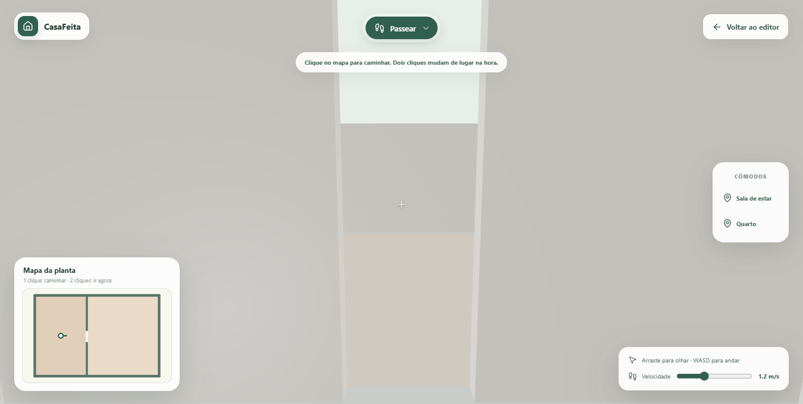

# CasaFeita

CasaFeita é um projeto gratuito e open source de **aplicativo instalado** para planejar uma casa a partir de uma planta editável, explorar os ambientes em 3D e testar móveis antes da obra. Fotos do terreno, plantas existentes, rabiscos e descrições poderão servir de referência para propostas, sempre com confirmação das medidas e preservação do contexto real.

## Estado atual

**Prévia 0.1 para Windows.** O aplicativo instalado já desenha paredes, cômodos e cotas em uma planta editável e mostra a estrutura em 3D em tempo real. A biblioteca local guarda até três projetos por perfil do Windows; é possível importar e exportar arquivos `.sh3d` para manter cópias fora dela. A interface CasaFeita usa uma seleção central em pílula e mantém as ferramentas de desenho discretas. O núcleo de edição deriva do SweetHomeJS; **Sweet Home 3D** orienta a profundidade funcional e **Floorplanner** orienta a clareza visual.





O modo **Mobiliar** inclui 16 modelos 3D reais de [Kenney](https://kenney.nl/assets/furniture-kit), organizados por ambiente. É possível inserir, mover na planta, girar, duplicar, excluir, escolher entre quatro acabamentos para as peças compatíveis e alterar largura, profundidade e altura. Os acabamentos compartilham a mesma geometria 3D, evitando cópias desnecessárias dos modelos. Os modelos, acabamentos e medidas permanecem no `.sh3d` ao reabrir.





O modo **Passear** ocupa a tela e permite clicar no minimapa para caminhar até um ponto livre. Um duplo clique muda de lugar imediatamente. A pílula vertical de cômodos também escolhe destinos, e WASD, mouse e controle de velocidade permitem explorar o espaço. As rotas contornam paredes e móveis; destinos bloqueados são recusados.



Esta é uma versão de desenvolvimento. Ampliação do catálogo, acabamento de materiais, escadas e referência de fotos/plantas existentes ainda estão no [roadmap](docs/roadmap.md). A biblioteca e a exportação local funcionam sem conta nem serviço pago.

## Executar no Windows

Requer Node.js e npm. Na raiz do repositório:

```powershell
npm ci
npm run build:engine
npm run build -w @casafeita/desktop
npm start -w @casafeita/desktop
```

Para gerar o instalador e um ZIP portátil, execute `npm run make -w @casafeita/desktop`. Os arquivos saem em `apps/desktop/out/make`. Se o gerenciador de pacotes bloquear o script de instalação do Electron e o executável estiver ausente, execute `node node_modules/electron/install.js` antes de iniciar. O instalador atual não é assinado digitalmente.

Os testes de integração usam `npx playwright test tests/`. Eles verificam o limite de três projetos, o ciclo de salvar, exportar e reabrir, uma rota por uma porta sem atravessar obstáculos, teleporte, velocidade e colisão da caminhada na janela Electron.

- [Análise arquitetural e bases open source](docs/analise-arquitetural.md)
- [Verificações da base candidata](docs/avaliacao-openplan3d.md)
- [Revisão para aplicativo instalado e avaliação de SweetHomeJS](docs/decisao-desktop.md)
- [Experiência, navegação e mobília](docs/experiencia-produto.md)
- [Direção visual e critérios de experiência](docs/direcao-visual.md)
- [Plano de evolução em entregas pequenas](docs/roadmap.md)

## Princípios

- A planta é um conjunto de paredes, aberturas, cômodos e medidas editáveis; o 3D é gerado a partir desses dados.
- Uma foto real é referência vinculada ao projeto. O sistema não deve trocar o terreno por um cenário inventado nem apresentar medidas desconhecidas como precisas.
- A casa aparece vazia primeiro; mobiliar é uma etapa separada.
- O passeio ocupa a tela, com controles discretos, minimapa clicável e acesso rápido aos cômodos. A planta e a mobília precisam ter recursos suficientes para uso real, com a maior parte dos comandos aparecendo no contexto da tarefa.
- O núcleo funciona sem assinatura e sem uma API paga obrigatória. Projetos podem ser exportados para que o usuário mantenha uma cópia.
- Cada entrega deve ser pequena, verificável e registrada em um commit com finalidade clara.

## Licença

O aplicativo derivado é distribuído sob [GPL v2 ou posterior](LICENSE). Os documentos originais publicados antes da incorporação mantêm a licença [MIT](LICENSE-MIT). A origem do núcleo está em [THIRD_PARTY.md](THIRD_PARTY.md). Modelos 3D e texturas mantêm suas próprias licenças e terão procedência registrada.
