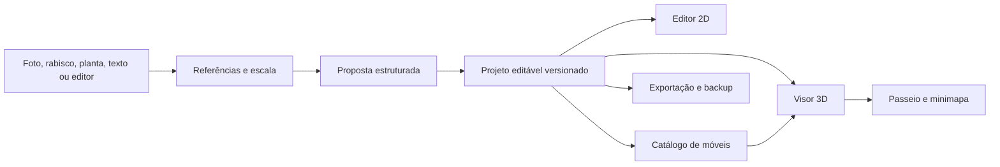

# Análise arquitetural inicial

Pesquisa realizada em 27/09/2026. Esta é uma decisão proposta para discussão; nenhum código de terceiros foi incorporado ao CasaFeita nesta fase.

## Recomendação

Usar **OpenPlan3D** como primeira base técnica para o editor web, mantendo seu histórico e licença MIT identificáveis. O projeto já dispõe de planta 2D com paredes e aberturas, cômodos, medidas, edição de móveis, prévia 3D, importação/exportação, salvamento local e testes. CasaFeita concentraria a primeira etapa de desenvolvimento em uma experiência mais simples e no passeio correto entre cômodos. A importação de fotos e a assistência por IA entram depois que a geometria manual, o passeio e o formato de projeto estiverem estáveis.

Antes de incorporar essa base, é necessário rodar e registrar os testes, o build e um teste manual do fluxo 2D → 3D no computador de desenvolvimento. **MIT no código não garante que todo modelo e textura anexado tenha a mesma licença**; os ativos precisam de inventário próprio.

### Comparação de projetos

| Projeto | O que já resolve | Limite para CasaFeita | Encaminhamento |
| --- | --- | --- | --- |
| [OpenPlan3D](https://github.com/laanlabs/openPlan3D) (MIT; SvelteKit, TypeScript, Three.js) | Editor 2D, 3D, móveis, histórico, exportações, armazenamento local e passeio básico. Tem documentação de capacidades e testes por recurso. | A câmera do passeio não bloqueia paredes, a altura é fixa e as teclas WASD atualmente giram a vista em vez de caminhar. Falta minimapa clicável com rotas. A interface tem mais controles que a proposta. | **Base recomendada**, sujeita à validação local e auditoria dos ativos. |
| [Blueprint3D](https://github.com/furnishup/blueprint3d) (MIT) | Modelo de planta, editor 2D, itens e visualização 3D. | Núcleo antigo com Grunt/jQuery; o próprio README aponta falta de testes e problemas de empacotamento. | Referência de domínio, não base preferida. |
| [blueprint3d-modern](https://github.com/charmlinn/blueprint3d-modern) (MIT) | Reescrita em TypeScript, Three.js atual, persistência local e catálogo. | O próprio roadmap ainda lista testes do modelo, desfazer/refazer e GLB/glTF como pendentes. | Alternativa se OpenPlan3D falhar na avaliação. |
| [react-planner](https://github.com/cvdlab/react-planner) (MIT) | Planta 2D, catálogo extensível e renderização 3D em React. | Arquitetura Redux/Immutable antiga; precisaria de atualização e de outro núcleo de navegação. | Consultar ideias de catálogo e representação de elementos. |
| [Sweet Home 3D](https://www.sweethome3d.com/download/) (GPL) | Editor residencial maduro, mobiliário e visualização 3D. | Aplicação Java desktop e licença copyleft dificultam aproveitamento seletivo no editor web MIT. | Referência de funcionalidades e ergonomia, sem copiar código. |

O artigo [*Architectural visualization with Astra*](https://developers.openai.com/blog/architectural-visualization-with-astra) descreve uma cena editável criada no Blender pela API Python e explorada no Unreal. É uma demonstração útil de **iterar sobre geometria verificável**, não uma biblioteca de editor residencial pronta para integrar. Blender pode futuramente servir como exportador/renderizador opcional; o fluxo principal deve continuar no navegador.

### O que foi conferido no código do OpenPlan3D

- O [catálogo](https://github.com/laanlabs/openPlan3D/blob/main/src/lib/utils/furnitureCatalog.ts) contém categorias e dimensões em centímetros; o usuário precisará poder revisar e substituir medidas padrão.
- A [persistência](https://github.com/laanlabs/openPlan3D/blob/main/src/lib/services/localDatabase.ts) usa IndexedDB no navegador, o que permite uma experiência inicial sem conta ou servidor de projetos.
- A [classe de movimento](https://github.com/laanlabs/openPlan3D/blob/main/src/lib/utils/walkthroughMotion.ts) atualiza a posição da câmera sem consulta a colisões; define `y` por piso + altura dos olhos e usa as setas para translação. Isso ainda não atende a caminhada WASD com gravidade e paredes sólidas solicitada aqui.
- O [visor 3D](https://github.com/laanlabs/openPlan3D/blob/main/src/lib/components/viewer3d/ThreeViewer.svelte) aplica o movimento diretamente à câmera. A raycast visível no arquivo serve para seleção no editor, não para impedir a travessia de paredes no passeio.
- A [matriz de recursos](https://github.com/laanlabs/openPlan3D/blob/main/FEATURES.md) relaciona funções aos testes e registra limites conhecidos; estas declarações serão checadas localmente antes da adoção.

## Arquitetura proposta

**Fonte de verdade:** um documento de projeto versionado, com unidades reais. Planta, miniatura, malhas 3D e mapa de navegação são representações derivadas. Nenhuma entrada de IA pode virar apenas uma imagem final sem paredes e aberturas editáveis.

| Entidade | Dados mínimos | Relação importante |
| --- | --- | --- |
| Terreno/referência | imagem original, pontos de ancoragem, orientação, medidas conhecidas, observações de árvores, relevo e construções | preserva a fonte e registra o que foi confirmado, inferido ou desconhecido |
| Pavimento | id, cota, altura útil | contém paredes, aberturas, cômodos e itens |
| Parede | id, extremidades/curva, espessura, altura, material | pode ser editada sem perder aberturas vinculadas |
| Abertura | id, paredeId, posição ao longo da parede, largura, altura, sentido/estado | portas influenciam colisão e rota; janelas não abrem passagem |
| Cômodo | id, nome, polígono validado, área calculada, ponto de navegação | nomes e pontos são usados pelo seletor lateral |
| Móvel | id, modeloId, categoria, largura/profundidade/altura, posição, rotação, material | mesma instância aparece em 2D e 3D; dimensões podem ser ajustadas |
| Origem de dado | tipo, arquivo/entrada, confiança, confirmação do usuário | acompanha elementos gerados ou estimados |

Usar um sistema de coordenadas único e documentado. O plano pode guardar `x,z` em metros e `y` como elevação; importadores fazem a conversão de centímetros, pixels ou unidades externas. O formato de arquivo deve incluir `schemaVersion` e migrações; IDs estáveis evitam perder associações ao editar paredes e cômodos.

### Foto, planta e IA

1. Guardar a imagem original como **referência imutável**; exibir sobreposição e pontos de alinhamento no editor.
2. Para escala, pedir ao menos uma medida conhecida ou marcar todas as dimensões inferidas como estimativas. Uma única foto em perspectiva não fornece, por si só, relevo e distâncias confiáveis.
3. Separar detecção de proposta: identificar candidatos a terreno, árvores, muros, piso, paredes e aberturas; converter somente os aceitos em entidades editáveis.
4. Mostrar a diferença antes de aplicar: itens preservados, novos, movidos e incertos. A IA não altera um elemento confirmado sem uma ação explícita do usuário.
5. A primeira assistência pode ser rastreamento semiautomático de uma planta escaneada; reconstrução de terreno real e geração por texto vêm após um conjunto de exemplos de avaliação.

[SAM 2](https://github.com/facebookresearch/sam2), sob Apache 2.0, pode ajudar a segmentar objetos em imagens; segmentação sozinha não reconhece dimensões, topologia de paredes ou intenção arquitetônica. O [CubiCasa5K](https://github.com/CubiCasa/CubiCasa5k) é referência de pesquisa para leitura de plantas, mas sua licença **CC BY-NC 4.0** exige uma análise separada antes de qualquer uso no produto ou distribuição de pesos/dados. O núcleo não dependerá desse material.

### Navegação

O minimapa deve ser gerado da **mesma planta validada** que produz o 3D. Um clique escolhe uma posição caminhável e solicita um caminho; duplo clique muda a câmera imediatamente para esse ponto. Um clique fora da área caminhável mostra o motivo e não atravessa uma parede. A caminhada assistida usa velocidade humana configurável (proposta inicial: 1,3 m/s), respeita portas e obstáculos, pode ser cancelada por movimento manual e informa quando não há rota. O seletor vertical de cômodos aponta para pontos de chegada válidos, com a mesma lógica.

[recast-navigation-js](https://github.com/isaac-mason/recast-navigation-js) (MIT) oferece geração de malha navegável e cálculo de rotas, inclusive em Web Worker. [Three.js](https://threejs.org/) continua responsável pela cena e câmera. Para colisão, comparar a geometria arquitetônica com o controlador cinemático do [Rapier](https://rapier.rs/) ou uma solução de cápsula/BVH; a escolha exige uma prova com portas estreitas, paredes diagonais e móveis. O mapa navegável deve ser reconstruído após mudanças geométricas, fora do fluxo de renderização.

O passeio manual exige WASD para deslocar, mouse para olhar, colisão com paredes, piso e móveis sólidos, altura dos olhos e gravidade. Troca de andar ocorre por escadas/passagens válidas. O comportamento atual do OpenPlan3D não deve ser chamado de completo antes dessa substituição.

### Mobília, ativos e desempenho

O catálogo guarda **tipos** e **variantes** separadamente. Um tipo oferece dimensões usuais e limites de ajuste; cada variante aponta para um modelo GLB, material, miniatura, licença, autor, origem e nível de detalhe. O usuário pode corrigir qualquer medida padrão. A planta mostra uma silhueta leve; o modelo 3D é carregado somente quando necessário. Isso permite variedade sem carregar centenas de arquivos ao abrir o projeto.

Começar por um conjunto curado de cama, sofá, mesa, cadeira, armário, TV, geladeira, fogão, pia, chuveiro e vaso; adicionar variações por pacotes. [Kenney Furniture Kit](https://kenney.nl/assets/furniture-kit) fornece 140 ativos CC0; [Poly Haven](https://polyhaven.com/license) fornece modelos e texturas CC0. Antes de copiar arquivos, conferir formato, dimensões físicas, qualidade visual e licença de cada item. Compressão GLB, texturas otimizadas, cache e instâncias para peças repetidas entram conforme as medições de desempenho, sem sacrificar a correção das medidas.

### Armazenamento, limite de projetos e custo

No primeiro lançamento, manter até **três projetos salvos por navegador** em IndexedDB, com exportação e importação de backup. Isso é uma regra de interface, não uma garantia de três por pessoa: sem conta, a mesma pessoa pode usar outro navegador. Se sincronização por conta for acrescentada, a cota de três deve ser aplicada também no servidor. Não bloquear a exportação de um projeto ao atingir o limite.

O editor manual e o passeio devem funcionar sem serviço pago. Assistência por IA que exija computação remota será opcional, com custo e destino dos dados mostrados antes do envio. A versão gratuita não pode depender de uma chave de API comercial para abrir ou editar um projeto.

## Critérios para adotar a base

- Reproduzir `npm ci`, verificação de tipos, testes unitários e build no checkout fixado por commit.
- Criar e salvar uma planta simples, recarregá-la e conferir medidas, aberturas, móveis e exportação.
- Registrar o commit exato da base e manter atribuição MIT; auditar ativos incluídos separadamente.
- Validar a possibilidade de trocar o movimento atual por um controlador com colisão e navegação assistida sem alterar o modelo de planta a cada iteração.
- Se esses pontos falharem de forma estrutural, comparar o custo de extrair apenas os módulos de geometria/editor com a alternativa `blueprint3d-modern`.
