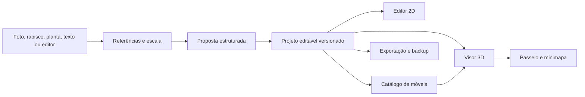

# Análise arquitetural

Pesquisa iniciada em 27/09/2026. A primeira recomendação foi revista após o usuário indicar Sweet Home 3D e Floorplanner como referências e escolher um **aplicativo instalado**. Leia a [decisão desktop e a avaliação de SweetHomeJS](decisao-desktop.md) para a direção atual. Os pacotes selecionados foram incorporados posteriormente; veja [THIRD_PARTY.md](../THIRD_PARTY.md).

## Recomendação

Construir primeiro para **Windows**, com uma interface CasaFeita própria e acabamento comparável ao Floorplanner. Usar o modelo/edição do Sweet Home 3D como padrão funcional. A tradução comunitária **SweetHomeJS** é a candidata principal para reaproveitar o núcleo em TypeScript, após a prova de integração e as correções registradas na [avaliação](decisao-desktop.md). A importação de fotos e a assistência por IA entram depois que geometria, mobília, passeio e arquivo editável estiverem estáveis.

Adotar código derivado de Sweet Home 3D exige **GPL v2 ou posterior** na distribuição do aplicativo e atribuição dos autores. A licença do repositório foi alterada no commit de incorporação; os documentos originais conservam a licença MIT anterior. Modelos e texturas exigem inventário de licença separado.

### Comparação de projetos

| Projeto | O que já resolve | Limite para CasaFeita | Encaminhamento |
| --- | --- | --- | --- |
| [OpenPlan3D](https://github.com/laanlabs/openPlan3D) (MIT; SvelteKit, TypeScript, Three.js) | Editor 2D, 3D, móveis, histórico, exportações, armazenamento local e passeio básico. Tem documentação de capacidades e testes por recurso. | A câmera do passeio não bloqueia paredes, a altura é fixa e as teclas WASD atualmente giram a vista em vez de caminhar. Falta minimapa clicável com rotas. A interface e o 3D não alcançam a referência visual solicitada. | Avaliação técnica histórica; **não é a direção visual nem a base principal**. |
| [Blueprint3D](https://github.com/furnishup/blueprint3d) (MIT) | Modelo de planta, editor 2D, itens e visualização 3D. | Núcleo antigo com Grunt/jQuery; o próprio README aponta falta de testes e problemas de empacotamento. | Referência de domínio, não base preferida. |
| [blueprint3d-modern](https://github.com/charmlinn/blueprint3d-modern) (MIT) | Reescrita em TypeScript, Three.js atual, persistência local e catálogo. | O próprio roadmap ainda lista testes do modelo, desfazer/refazer e GLB/glTF como pendentes. | Referência secundária de arquitetura. |
| [react-planner](https://github.com/cvdlab/react-planner) (MIT) | Planta 2D, catálogo extensível e renderização 3D em React. | Arquitetura Redux/Immutable antiga; precisaria de atualização e de outro núcleo de navegação. | Consultar ideias de catálogo e representação de elementos. |
| [Sweet Home 3D](https://www.sweethome3d.com/download/) (GPL v2+) | Editor residencial maduro, mobiliário, pavimentos, medidas, arquivo `.sh3d` e visualização 3D. | A interface Swing atual exigiria uma reconstrução grande para seguir o desenho desejado. | Referência funcional; seu formato/modelo podem ser reaproveitados sob GPL. |
| [SweetHomeJS](https://github.com/njhurst/sweethomejs) (GPL v2+) | Tradução TypeScript do núcleo e editor 2D/3D com pacotes separados. | Build raiz quebrado por ordem de dependência, um teste com caminho Windows inválido, catálogo sem modelos 3D e UI utilitária. | **Candidato principal para o núcleo**, condicionado à prova de integração. |
| [Floorplanner](https://floorplanner.com/personal) (proprietário) | Referência de fluxo fácil, medidas precisas, catálogo pesquisável e apresentação visual. | Código e ativos não estão disponíveis para redistribuição open source. | Referência de experiência e qualidade, sem copiar arquivos. |

O artigo [*Architectural visualization with Astra*](https://developers.openai.com/blog/architectural-visualization-with-astra) descreve uma cena editável criada no Blender pela API Python e explorada no Unreal. É uma demonstração útil de **iterar sobre geometria verificável**, não uma biblioteca de editor residencial pronta para integrar. Blender pode futuramente servir como exportador/renderizador opcional; o fluxo principal será o aplicativo instalado.

### O que foi conferido no código do OpenPlan3D antes da revisão

- O [catálogo](https://github.com/laanlabs/openPlan3D/blob/main/src/lib/utils/furnitureCatalog.ts) contém categorias e dimensões em centímetros; o usuário precisará poder revisar e substituir medidas padrão.
- A [persistência](https://github.com/laanlabs/openPlan3D/blob/main/src/lib/services/localDatabase.ts) usa IndexedDB no navegador, o que permite uma experiência inicial sem conta ou servidor de projetos.
- A [classe de movimento](https://github.com/laanlabs/openPlan3D/blob/main/src/lib/utils/walkthroughMotion.ts) atualiza a posição da câmera sem consulta a colisões; define `y` por piso + altura dos olhos e usa as setas para translação. Isso ainda não atende a caminhada WASD com gravidade e paredes sólidas solicitada aqui.
- O [visor 3D](https://github.com/laanlabs/openPlan3D/blob/main/src/lib/components/viewer3d/ThreeViewer.svelte) aplica o movimento diretamente à câmera. A raycast visível no arquivo serve para seleção no editor, não para impedir a travessia de paredes no passeio.
- A [matriz de recursos](https://github.com/laanlabs/openPlan3D/blob/main/FEATURES.md) relaciona funções aos testes e registra limites conhecidos; estas declarações serão checadas localmente antes da adoção.

## Arquitetura proposta

**Fonte de verdade:** um documento de projeto versionado, com unidades reais. Planta, miniatura, malhas 3D e mapa de navegação são representações derivadas. Nenhuma entrada de IA pode virar apenas uma imagem final sem paredes e aberturas editáveis.

| Entidade | Dados mínimos | Relação importante |
| --- | --- | --- |
| Terreno/referência | imagem original, pontos de ancoragem, orientação, medidas conhecidas, observações de árvores, relevo e construções | preserva a fonte e registra o que foi confirmado, inferido ou desconhecido |
| Pavimento | id, cota, altura útil | contém paredes, aberturas, cômodos e itens |
| Parede | id, extremidades/curva, espessura, altura, material | pode ser editada sem perder aberturas vinculadas |
| Abertura | id, paredeId, posição ao longo da parede, largura, altura, sentido/estado | portas influenciam colisão e rota; janelas não abrem passagem |
| Cômodo | id, nome, polígono validado, área calculada, ponto de navegação | nomes e pontos são usados pelo seletor lateral |
| Móvel | id, modeloId, categoria, largura/profundidade/altura, posição, rotação, material | mesma instância aparece em 2D e 3D; dimensões podem ser ajustadas |
| Origem de dado | tipo, arquivo/entrada, confiança, confirmação do usuário | acompanha elementos gerados ou estimados |

Usar um sistema de coordenadas único e documentado. O plano pode guardar `x,z` em metros e `y` como elevação; importadores fazem a conversão de centímetros, pixels ou unidades externas. O formato de arquivo deve incluir `schemaVersion` e migrações; IDs estáveis evitam perder associações ao editar paredes e cômodos.

### Foto, planta e IA

1. Guardar a imagem original como **referência imutável**; exibir sobreposição e pontos de alinhamento no editor.
2. Para escala, pedir ao menos uma medida conhecida ou marcar todas as dimensões inferidas como estimativas. Uma única foto em perspectiva não fornece, por si só, relevo e distâncias confiáveis.
3. Separar detecção de proposta: identificar candidatos a terreno, árvores, muros, piso, paredes e aberturas; converter somente os aceitos em entidades editáveis.
4. Mostrar a diferença antes de aplicar: itens preservados, novos, movidos e incertos. A IA não altera um elemento confirmado sem uma ação explícita do usuário.
5. A primeira assistência pode ser rastreamento semiautomático de uma planta escaneada; reconstrução de terreno real e geração por texto vêm após um conjunto de exemplos de avaliação.

[SAM 2](https://github.com/facebookresearch/sam2), sob Apache 2.0, pode ajudar a segmentar objetos em imagens; segmentação sozinha não reconhece dimensões, topologia de paredes ou intenção arquitetônica. O [CubiCasa5K](https://github.com/CubiCasa/CubiCasa5k) é referência de pesquisa para leitura de plantas, mas sua licença **CC BY-NC 4.0** exige uma análise separada antes de qualquer uso no produto ou distribuição de pesos/dados. O núcleo não dependerá desse material.

### Navegação

O minimapa deve ser gerado da **mesma planta validada** que produz o 3D. Um clique escolhe uma posição caminhável e solicita um caminho; duplo clique muda a câmera imediatamente para esse ponto. Um clique fora da área caminhável mostra o motivo e não atravessa uma parede. A caminhada assistida usa velocidade humana configurável (proposta inicial: 1,3 m/s), respeita portas e obstáculos, pode ser cancelada por movimento manual e informa quando não há rota. O seletor vertical de cômodos aponta para pontos de chegada válidos, com a mesma lógica.

[recast-navigation-js](https://github.com/isaac-mason/recast-navigation-js) (MIT) oferece geração de malha navegável e cálculo de rotas, inclusive em Web Worker. [Three.js](https://threejs.org/) continua responsável pela cena e câmera. Para colisão, comparar a geometria arquitetônica com o controlador cinemático do [Rapier](https://rapier.rs/) ou uma solução de cápsula/BVH; a escolha exige uma prova com portas estreitas, paredes diagonais e móveis. O mapa navegável deve ser reconstruído após mudanças geométricas, fora do fluxo de renderização.

O passeio manual exige WASD para deslocar, mouse para olhar, colisão com paredes, piso e móveis sólidos, altura dos olhos e gravidade. Troca de andar ocorre por escadas/passagens válidas. O comportamento atual do OpenPlan3D não deve ser chamado de completo antes dessa substituição.

### Mobília, ativos e desempenho

O catálogo guarda **tipos** e **variantes** separadamente. Um tipo oferece dimensões usuais e limites de ajuste; cada variante aponta para um modelo GLB, material, miniatura, licença, autor, origem e nível de detalhe. O usuário pode corrigir qualquer medida padrão. A planta mostra uma silhueta leve; o modelo 3D é carregado somente quando necessário. Isso permite variedade sem carregar centenas de arquivos ao abrir o projeto.

Começar por um conjunto curado de cama, sofá, mesa, cadeira, armário, TV, geladeira, fogão, pia, chuveiro e vaso; adicionar variações por pacotes. [Kenney Furniture Kit](https://kenney.nl/assets/furniture-kit) fornece 140 ativos CC0; [Poly Haven](https://polyhaven.com/license) fornece modelos e texturas CC0. Antes de copiar arquivos, conferir formato, dimensões físicas, qualidade visual e licença de cada item. Compressão GLB, texturas otimizadas, cache e instâncias para peças repetidas entram conforme as medições de desempenho, sem sacrificar a correção das medidas.

### Armazenamento, limite de projetos e custo

No primeiro lançamento, manter até **três projetos na biblioteca local do aplicativo**, com exportação e importação de arquivo editável. Isso atende à organização e ao limite de espaço da biblioteca, mas não garante três por pessoa: sem conta, alguém pode copiar arquivos, reinstalar ou usar outro computador. Se sincronização por conta for acrescentada, a cota de três pode ser aplicada também no servidor. Nunca bloquear a exportação ou apagar um projeto sem escolha do usuário.

O editor manual e o passeio devem funcionar sem serviço pago. Assistência por IA que exija computação remota será opcional, com custo e destino dos dados mostrados antes do envio. A versão gratuita não pode depender de uma chave de API comercial para abrir ou editar um projeto.

## Critérios para adotar a base

- Corrigir o build do SweetHomeJS no Windows e rodar tipos, testes e fluxo de navegador em checkout fixado por commit.
- Criar e salvar uma planta simples, recarregá-la e conferir medidas, aberturas, móveis e 3D.
- Confirmar que a camada de modelo/controladores pode ser usada com uma interface CasaFeita própria, sem herdar os menus e painéis antigos.
- Registrar versão, GPL, avisos dos autores e licenças de modelos antes de distribuir uma versão derivada.
- Validar que o passeio com colisão e rotas pode derivar da planta editável sem alterar o arquivo a cada iteração.
- Se a integração falhar de forma estrutural, reavaliar o Sweet Home 3D JS oficial e o custo de um núcleo próprio.
